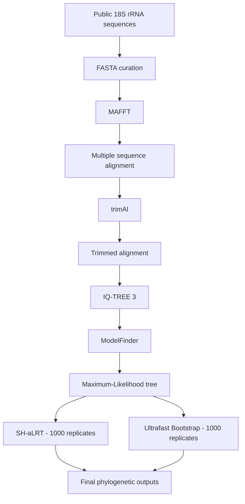

# 🧬 Bioinformatics Pipeline  — 18S rRNA Phylogenetic Workflow

A reproducible command-line workflow for **18S rRNA sequence curation, multiple sequence alignment, alignment trimming, evolutionary model selection, and Maximum-Likelihood phylogenetic inference**.

This repository was prepared for **portfolio, educational, and reproducibility purposes** using only publicly available sequence data.

> ⚠️ No unpublished samples, internal identifiers, unpublished hosts, candidate species names, unpublished phylogenetic trees, genetic-distance results, or manuscript-specific conclusions are included.

---

## 📌 Overview

The pipeline automates the main steps of a molecular phylogenetic analysis:

```text
Public 18S rRNA sequences
        │
        ▼
FASTA curation
        │
        ▼
Multiple Sequence Alignment
        MAFFT
        │
        ▼
Alignment Trimming
        trimAl
        │
        ▼
Model Selection
        ModelFinder
        │
        ▼
Maximum-Likelihood Phylogeny
        IQ-TREE 3
        │
        ├── 1,000 SH-aLRT replicates
        └── 1,000 Ultrafast Bootstrap replicates
        │
        ▼
Final phylogenetic outputs
```

---

## 🎯 Objectives

This project demonstrates how to:

- organize public nucleotide sequence datasets;
- work with FASTA files;
- perform multiple sequence alignment;
- remove poorly aligned or ambiguous regions;
- select nucleotide substitution models;
- infer Maximum-Likelihood phylogenies;
- estimate branch support;
- automate bioinformatics workflows using Bash;
- preserve intermediate outputs for reproducibility;
- organize computational analyses for GitHub.

---

## 🧰 Technologies and Tools

### 🐧 Bash / Linux

The workflow is automated using Bash and designed for command-line execution in Linux-compatible environments.

Main computational tools:

- **MAFFT**
- **trimAl**
- **IQ-TREE 3**
- **ModelFinder**
- **Bash**
- **Git**
- **GitHub**

---

### 🧬 MAFFT

[MAFFT](https://mafft.cbrc.jp/alignment/software/) is used for multiple sequence alignment.

```bash
mafft --auto input_sequences.fasta > alignment_mafft.fasta
```

The `--auto` option allows MAFFT to automatically select an alignment strategy according to the characteristics of the dataset.

**Role in the pipeline:**

- aligns homologous nucleotide sequences;
- maintains positional homology;
- supports sequences with different lengths;
- generates the alignment used in downstream analyses.

---

### ✂️ trimAl

[trimAl](http://trimal.cgenomics.org/) is used to remove poorly aligned and ambiguous regions from the multiple sequence alignment.

```bash
trimal \
  -in alignment_mafft.fasta \
  -out alignment_trimmed.fasta \
  -automated1
```

The `-automated1` option automatically selects a trimming strategy based on the characteristics of the alignment.

**Role in the pipeline:**

- reduces poorly aligned regions;
- removes ambiguous alignment positions;
- decreases phylogenetic noise;
- prepares the alignment for downstream model selection.

---

### 🌳 IQ-TREE 3

[IQ-TREE](https://iqtree.github.io/) is used for:

- evolutionary model selection;
- Maximum-Likelihood phylogenetic inference;
- SH-aLRT branch support;
- Ultrafast Bootstrap analysis.

```bash
iqtree3 \
  -s alignment_trimmed.fasta \
  -m MFP \
  -bb 1000 \
  -alrt 1000
```

### Main parameters

| Parameter | Description |
|---|---|
| `-s` | Input sequence alignment |
| `-m MFP` | Automatic evolutionary model selection |
| `-bb 1000` | 1,000 Ultrafast Bootstrap replicates |
| `-alrt 1000` | 1,000 SH-aLRT replicates |

---

## 🧮 Model Selection

Evolutionary model selection is performed using **ModelFinder Plus**, integrated into IQ-TREE.

The option:

```text
-m MFP
```

allows IQ-TREE to compare alternative nucleotide substitution models and automatically select the best-fitting model.

The selected model is reported in the IQ-TREE output:

```text
*.iqtree
```

The exact evolutionary model is intentionally not hard-coded in this repository because it may change depending on the sequences included in the dataset.

This improves the portability and reproducibility of the workflow.

---

## 🔬 Public Demonstration Dataset

This public version of the pipeline uses **only sequences already available in public databases such as GenBank**.

Example accession numbers that may be used in a demonstration dataset include:

```text
MH503891
MH503892
MW540605
MW540607
MF476203
KX507248
KX507249
HQ224959
KM887507
KM887509
KF257928
```

The actual nucleotide sequences should be retrieved directly from GenBank.

---

## 🧹 Dataset Curation

Before running the alignment, the dataset should be inspected and curated.

Recommended steps include:

1. retrieving sequences from public databases;
2. checking accession numbers;
3. standardizing FASTA headers;
4. removing duplicated entries;
5. verifying sequence orientation;
6. inspecting sequence lengths;
7. checking sequence quality;
8. selecting homologous regions;
9. removing sequences outside the analytical objective;
10. selecting representative taxa;
11. defining an appropriate outgroup;
12. documenting all dataset modifications.

Dataset curation is treated as an explicit part of the workflow rather than an undocumented manual step.

---

## 📂 Repository Structure

```text
bioinformatics-pipeline-3.4/
│
├── README.md
├── LICENSE
│
├── data/
│   ├── raw/
│   │   └── genbank_sequences.fasta
│   │
│   └── metadata/
│       └── accession_metadata.csv
│
├── input/
│   └── input_sequences.fasta
│
├── alignment/
│   ├── alignment_mafft.fasta
│   └── alignment_trimmed.fasta
│
├── phylogeny/
│   ├── public_18S.treefile
│   ├── public_18S.iqtree
│   ├── public_18S.log
│   └── public_18S.contree
│
├── scripts/
│   └── pipeline_3_4.sh
│
└── figures/
    └── phylogenetic_tree_public.png
```

---

## ⚙️ Running the Pipeline

First, make the script executable:

```bash
chmod +x scripts/pipeline_3_4.sh
```

Then run:

```bash
./scripts/pipeline_3_4.sh
```

The workflow expects the input FASTA file at:

```text
input/input_sequences.fasta
```

---

## 💻 Pipeline Script

```bash
#!/usr/bin/env bash

set -euo pipefail

# ==========================================================
# Bioinformatics Pipeline 3.4 — Public Version
# 18S rRNA phylogenetic workflow
# ==========================================================

INPUT="input/input_sequences.fasta"

ALIGNMENT_DIR="alignment"
PHYLOGENY_DIR="phylogeny"

MAFFT_OUT="${ALIGNMENT_DIR}/alignment_mafft.fasta"
TRIMMED_OUT="${ALIGNMENT_DIR}/alignment_trimmed.fasta"

IQTREE_PREFIX="${PHYLOGENY_DIR}/public_18S"

THREADS="AUTO"

echo "=============================================="
echo " Bioinformatics Pipeline 3.4"
echo "=============================================="

# ----------------------------------------------------------
# 1. Check dependencies
# ----------------------------------------------------------

for tool in mafft trimal iqtree3; do

    if ! command -v "$tool" >/dev/null 2>&1; then

        echo "ERROR: Required tool '$tool' was not found in PATH."

        exit 1

    fi

done

# ----------------------------------------------------------
# 2. Check input file
# ----------------------------------------------------------

if [[ ! -f "$INPUT" ]]; then

    echo "ERROR: Input FASTA file not found:"
    echo "       $INPUT"

    exit 1

fi

# ----------------------------------------------------------
# 3. Create output directories
# ----------------------------------------------------------

mkdir -p "$ALIGNMENT_DIR"
mkdir -p "$PHYLOGENY_DIR"

# ----------------------------------------------------------
# 4. MAFFT
# ----------------------------------------------------------

echo
echo "[1/3] Running MAFFT..."

mafft \
    --auto \
    "$INPUT" \
    > "$MAFFT_OUT"

echo "MAFFT output:"
echo "  $MAFFT_OUT"

# ----------------------------------------------------------
# 5. trimAl
# ----------------------------------------------------------

echo
echo "[2/3] Running trimAl..."

trimal \
    -in "$MAFFT_OUT" \
    -out "$TRIMMED_OUT" \
    -automated1

echo "trimAl output:"
echo "  $TRIMMED_OUT"

# ----------------------------------------------------------
# 6. IQ-TREE 3
# ----------------------------------------------------------

echo
echo "[3/3] Running IQ-TREE 3..."

iqtree3 \
    -s "$TRIMMED_OUT" \
    -m MFP \
    -bb 1000 \
    -alrt 1000 \
    -nt "$THREADS" \
    -pre "$IQTREE_PREFIX"

echo
echo "=============================================="
echo " Pipeline completed successfully"
echo "=============================================="

echo
echo "Main outputs:"
echo "  ${IQTREE_PREFIX}.treefile"
echo "  ${IQTREE_PREFIX}.iqtree"
echo "  ${IQTREE_PREFIX}.log"
echo "  ${IQTREE_PREFIX}.contree"
```

---

## 📊 Main Outputs

After a successful run, the workflow produces:

```text
phylogeny/public_18S.treefile
phylogeny/public_18S.iqtree
phylogeny/public_18S.log
phylogeny/public_18S.contree
```

### `.treefile`

Contains the best Maximum-Likelihood phylogenetic tree.

### `.iqtree`

Contains detailed information about the analysis, including:

- number of sequences;
- alignment length;
- evolutionary model selection;
- likelihood scores;
- nucleotide frequencies;
- substitution parameters;
- branch-support statistics.

### `.log`

Execution log generated by IQ-TREE.

### `.contree`

Consensus tree generated from bootstrap replicates.

---

## 📈 Branch Support

The workflow estimates branch support using two complementary approaches.

### SH-aLRT

```text
1,000 replicates
```

### Ultrafast Bootstrap

```text
1,000 replicates
```

Node support can therefore be represented as:

```text
SH-aLRT / Ultrafast Bootstrap
```

---

## 🔄 Reproducibility

The repository separates each analytical stage:

```text
Raw public sequences
        ↓
Curated FASTA input
        ↓
MAFFT alignment
        ↓
trimAl alignment
        ↓
IQ-TREE analysis
        ↓
Phylogenetic outputs
```

This structure improves:

- reproducibility;
- traceability;
- debugging;
- dataset replacement;
- workflow reuse.

---

## 🔐 Data Privacy and Publication Safety

This repository is intentionally sanitized for public release.

It does **not** contain:

- unpublished nucleotide sequences;
- internal sample identifiers;
- unpublished host information;
- unpublished geographic sampling information;
- unpublished candidate species names;
- unpublished genetic-distance values;
- unpublished phylogenetic placements;
- manuscript-specific alignments;
- manuscript-specific phylogenetic trees;
- manuscript-specific biological conclusions.

Only publicly available data should be committed to this repository.

---

## 🧠 Skills Demonstrated

### Bioinformatics

- molecular sequence analysis;
- FASTA manipulation;
- sequence curation;
- multiple sequence alignment;
- phylogenetic inference;
- evolutionary model selection.

### Data and Automation

- Bash scripting;
- Linux command line;
- workflow automation;
- data quality control;
- structured project organization;
- reproducible computational research.

### Tools

```text
Bash
Linux
MAFFT
trimAl
IQ-TREE 3
ModelFinder
GenBank
FASTA
Git
GitHub
```

---

## 🗺️ Workflow Diagram



---

## 📚 References

### MAFFT

Katoh K, Standley DM.  
MAFFT Multiple Sequence Alignment Software Version 7: Improvements in Performance and Usability.  
*Molecular Biology and Evolution*. 2013.

### trimAl

Capella-Gutiérrez S, Silla-Martínez JM, Gabaldón T.  
trimAl: a tool for automated alignment trimming in large-scale phylogenetic analyses.  
*Bioinformatics*. 2009.

### IQ-TREE

Minh BQ et al.  
IQ-TREE 2: New Models and Efficient Methods for Phylogenetic Inference in the Genomic Era.  
*Molecular Biology and Evolution*. 2020.

---

## 👨‍💻 Author

**Danilo Pelaes de Almeida**

Research interests:

- 🧬 Bioinformatics
- 📊 Data Science
- 🧪 Molecular Biology
- 🌿 Biodiversity

**GitHub:** `github.com/Almeidadp`  
**LinkedIn:** `linkedin.com/in/danilo-almeida-00107b64`

---

## 📄 License

This repository is intended for educational, scientific, portfolio, and reproducibility purposes.

Public biological sequences remain associated with their original database records and publications.
