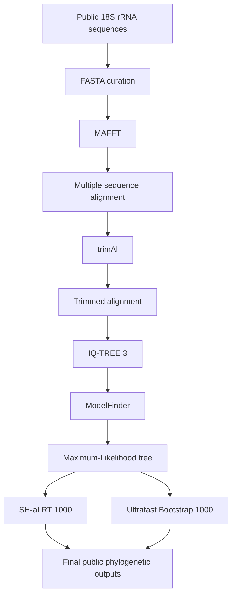

Bioinformatics Pipeline 3.4 — Public 18S rRNA Phylogenetic Workflow

A reproducible command-line workflow for 18S rRNA sequence curation, multiple sequence alignment, alignment trimming, evolutionary model selection, and Maximum-Likelihood phylogenetic inference.

This public version was prepared exclusively for portfolio, educational, and reproducibility purposes. It uses only publicly available sequences and intentionally excludes unpublished samples, internal sample codes, unpublished hosts, candidate species names, unpublished trees, genetic-distance results, and any other non-public biological result.

────────

Overview

The workflow is organized as:

```text
Public 18S rRNA sequences
        │
        ▼
FASTA curation and metadata checking
        │
        ▼
Multiple sequence alignment — MAFFT
        │
        ▼
Alignment trimming — trimAl
        │
        ▼
Quality-controlled alignment
        │
        ▼
Model selection — ModelFinder
        │
        ▼
Maximum-Likelihood phylogeny — IQ-TREE 3
        │
        ├── 1,000 SH-aLRT replicates
        └── 1,000 Ultrafast Bootstrap replicates
        │
        ▼
Final phylogenetic outputs
```

────────

Objectives

This repository demonstrates how to:

• organize a public nucleotide dataset in FASTA format;
• standardize sequence identifiers;
• align homologous 18S rRNA sequences;
• remove poorly aligned or ambiguous regions;
• select an evolutionary substitution model;
• infer a Maximum-Likelihood phylogeny;
• estimate branch support;
• preserve intermediate outputs for reproducibility;
• automate the workflow with Bash.

────────

Tools

MAFFT

Used for multiple sequence alignment.

```bash
mafft --auto input_sequences.fasta > alignment_mafft.fasta
```

trimAl

Used to remove poorly aligned or ambiguous alignment regions.

```bash
trimal \
  -in alignment_mafft.fasta \
  -out alignment_trimmed.fasta \
  -automated1
```

IQ-TREE 3

Used for evolutionary model selection and Maximum-Likelihood phylogenetic inference.

```bash
iqtree3 \
  -s alignment_trimmed.fasta \
  -m MFP \
  -bb 1000 \
  -alrt 1000
```

ModelFinder

Activated by:

```text
-m MFP
```

The best-fit model is determined from the public demonstration dataset itself and should therefore be read from the IQ-TREE output rather than hard-coded into the repository.

────────

Public Dataset

The repository should contain only sequences already available in public databases such as GenBank.

A metadata table can be stored as:

```text
data/metadata/accession_metadata.csv
```

Suggested columns:

|accession       |taxon       |host       |country|marker  |source |
|----------------|------------|-----------|-------|--------|-------|
|PUBLIC_ACCESSION|Public taxon|Public host|Country|18S rRNA|GenBank|

Do not include unpublished sample IDs or unpublished biological metadata.

────────

Repository Structure

```text
bioinformatics-pipeline-3.4/
│
├── README.md
├── LICENSE
│
├── data/
│   ├── raw/
│   │   └── genbank_sequences.fasta
│   └── metadata/
│       └── accession_metadata.csv
│
├── input/
│   └── input_sequences.fasta
│
├── alignment/
│   ├── alignment_mafft.fasta
│   └── alignment_trimmed.fasta
│
├── phylogeny/
│   ├── alignment_trimmed.fasta.treefile
│   ├── alignment_trimmed.fasta.iqtree
│   ├── alignment_trimmed.fasta.log
│   └── alignment_trimmed.fasta.contree
│
├── scripts/
│   └── pipeline_3_4.sh
│
└── figures/
    └── phylogenetic_tree_public.png
```

────────

Running the Pipeline

Make the script executable:

```bash
chmod +x scripts/pipeline_3_4.sh
```

Run:

```bash
./scripts/pipeline_3_4.sh
```

The script expects the input file:

```text
input/input_sequences.fasta
```

────────

Pipeline Steps

1. Input validation

The workflow verifies that the FASTA file exists and that the required software is available in the system.

2. Multiple sequence alignment

MAFFT aligns the 18S rRNA sequences:

```bash
mafft --auto input/input_sequences.fasta > alignment/alignment_mafft.fasta
```

3. Alignment trimming

trimAl removes unreliable alignment regions:

```bash
trimal \
  -in alignment/alignment_mafft.fasta \
  -out alignment/alignment_trimmed.fasta \
  -automated1
```

4. Model selection and phylogenetic inference

IQ-TREE 3 evaluates substitution models and reconstructs the Maximum-Likelihood tree:

```bash
iqtree3 \
  -s alignment/alignment_trimmed.fasta \
  -m MFP \
  -bb 1000 \
  -alrt 1000 \
  -pre phylogeny/public_18S
```

────────

Main Outputs

After a successful run, the main files include:

```text
phylogeny/public_18S.treefile
phylogeny/public_18S.iqtree
phylogeny/public_18S.log
phylogeny/public_18S.contree
```

.treefile

Best Maximum-Likelihood tree.

.iqtree

Detailed report containing:

• dataset statistics;
• model-selection results;
• likelihood information;
• substitution-model parameters;
• branch-support information.

.log

Execution log.

.contree

Consensus tree derived from bootstrap replicates.

────────

Branch Support

The pipeline uses:

```text
1,000 SH-aLRT replicates
1,000 Ultrafast Bootstrap replicates
```

These are executed with:

```bash
-alrt 1000
-bb 1000
```

Node support may be reported as:

```text
SH-aLRT / Ultrafast Bootstrap
```

────────

Reproducibility

The repository separates:

```text
Raw public data
      ↓
Curated input
      ↓
Alignment
      ↓
Trimmed alignment
      ↓
Phylogenetic inference
      ↓
Results
```

This structure makes it easier to inspect intermediate files, repeat the analysis, and replace the demonstration dataset without modifying the core workflow.

────────

Privacy and Unpublished Data

This repository is intentionally sanitized for public release.

It does not contain:

• unpublished biological sequences;
• internal sample identifiers;
• unpublished host records;
• candidate species names;
• unpublished genetic-distance values;
• unpublished phylogenetic placements;
• unpublished alignments;
• unpublished phylogenetic trees;
• manuscript-specific conclusions.

Only public demonstration data should be committed to this repository.

────────

Skills Demonstrated

This project demonstrates practical experience with:

• Bash;
• Linux command-line workflows;
• bioinformatics pipeline design;
• FASTA manipulation;
• biological database curation;
• data quality control;
• MAFFT;
• trimAl;
• IQ-TREE 3;
• ModelFinder;
• molecular phylogenetics;
• workflow automation;
• reproducible computational research;
• Git and GitHub.

────────

Workflow Diagram



────────

Author

Danilo Pelaes de Almeida

Areas of interest:

• Bioinformatics
• Data Science
• Molecular Biology
• Biodiversity

GitHub: github.com/Almeidadp

LinkedIn: linkedin.com/in/danilo-almeida-00107b64

────────

License

This repository is intended for educational, scientific, portfolio, and reproducibility purposes.

Public biological sequences remain associated with their original database records and publications.